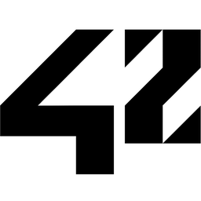

# My 42 School journey 

This repository houses a collection of projects I completed as part of my coursework at 42, the innovative and project-based coding school. From mastering data structures to tackling complex algorithms and creating real-world applications, these projects reflect my journey in honing my programming skills and problem-solving abilities. Explore the code, commit history, and see the progression of my coding proficiency throughout the course.

## Disclaimer (primarily for 42 students)

Please be aware that the code in this repository contains solutions to the assignments from the 42 curriculum. It is essential to uphold academic integrity and adhere to your institution's code of conduct. This repository is meant for reference and learning purposes only. Use it responsibly and ensure that you understand and complete your assignments independently.

While collaboration is encouraged, it's essential to emphasize that 42's educational model prioritizes independent problem-solving and individual growth. Please use this repository responsibly, respect the 42 academic code of conduct, and ensure that you tackle your assignments and projects with your unique approach. Copying or submitting this code as your own work goes against the principles of 42 and may have consequences in line with the school's policies.